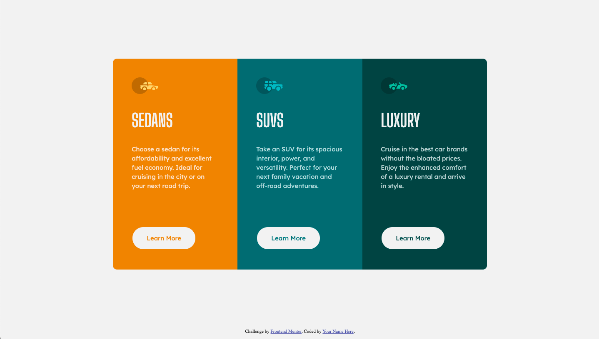

# Frontend Mentor - 3-column preview card component solution

This is a solution to the [3-column preview card component challenge on Frontend Mentor](https://www.frontendmentor.io/challenges/3column-preview-card-component-pH92eAR2-). Frontend Mentor challenges help you improve your coding skills by building realistic projects. 

## Table of contents

- [Overview](#overview)
  - [The challenge](#the-challenge)
  - [Screenshot](#screenshot)
  - [Links](#links)
- [My process](#my-process)
  - [Built with](#built-with)
  - [What I learned](#what-i-learned)
- [Author](#author)

**Note: Delete this note and update the table of contents based on what sections you keep.**

## Overview

This is a challenged that helped me streghthen my skills with CSS FlexBox Layout. I applied the Mobile-First approach to complete this challenge, and in doing so learned much about how it worked and how I could implement other codes for bigger screens.

### The challenge

Users should be able to:

- View the optimal layout depending on their device's screen size
- See hover states for interactive elements

### Screenshot



### Links

- Solution URL: [Add solution URL here](https://your-solution-url.com)
- Live Site URL: [Add live site URL here](https://your-live-site-url.com)a

## My process

### Built with

- HTML5 markup
- CSS
- Flexbox
- Mobile-first workflow

### What I learned

The biggest concept I learned through this challenge was the use of FlexBox. I am surprised how it simplified things. Also, I learned about buttons and the 'hover' pseudo-attribute(I guess).

```css
.button{
    background-color: hsl(0, 0%, 95%);
    border: 2px solid hsl(0, 0%, 95%);
    padding: 15px 32px;
    text-align: center;
    text-decoration: none;
    font-size: 15px;
    font-family: "Lexend Deca";
    margin: 4px 2px;
    cursor: pointer;
    border-radius: 55px;
}
.button:hover{
    background-color: transparent;
    color: hsl(0, 0%, 95%);
}
```

## Author

- Website - [Sarthak Malla](https://www.your-site.com)
- Frontend Mentor - [@sarthakmalla1154](https://www.frontendmentor.io/profile/sarthakmalla1154)

**Note: Delete this note and add/remove/edit lines above based on what links you'd like to share.**
